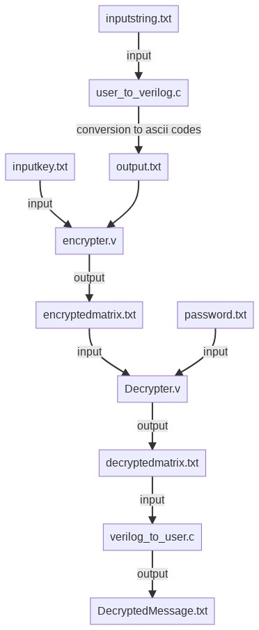

# **CS203 Project: Encryption Decryption using MM**

# **Instructions:**
   - ## *How to run:*
      1. Firstly write the message you want to send to the user in "inputstring.txt".
      2. Then write the key, i.e 2*2 matrix, in "inputkey.txt".
      3. Then run "user_to_verilog.c" which writes corresponding message in ascii codes in "output.txt"
      4. Then run "Encrypter.v" which will convert message into encrypted numbers.
      5. Then enter the password, i.e the same key matrix, in "password.txt".
      6. Then run "Decrypter.v" which will decrypt the encrypted matrix into ascii codes, if password is correct, in "decryptedmatrix.txt".
      7. Finally run "verilog_to_user.c" to get the message in "decryptedmessage.txt"

# Module Hierarchy

  

# Important Notes:
    1. Encrypter.v can encrypt upto 2000 characters in a single go, we are looking to make this limit dynamic (if possible).
       Thus, the text in inputstring.txt should not exceed 2000 characters.
    2. inputkey.txt should have a 2*2 matrix of integers, falling in the range 1 to 127 inclusive.

   
